# 🧾 Agentic Invoice Processor (Capstone Project)

> **A Tiered, Self-Correcting Multi-Agent System for High-Precision Invoice Extraction**

## 📖 Project Overview

This project implements an intelligent **Multi-Agent System** designed to extract structured data from diverse invoice formats.

**The Challenge:**
This solution is built for a healthcare administration office managing **150+ independent health professionals**. Every professional submits hours using their own unique invoice layout (Word, Excel, PDF export), making traditional template-based extraction impossible.

**The Solution:**
Unlike standard "wrapper" solutions, this system employs a **Hybrid Architecture** combining deterministic software engineering (Regex) with probabilistic AI (LLMs). 

The **Self-Correcting Orchestrator** actively monitors data quality. When critical fields (such as KvK or VAT numbers) are missing from the raw text, the system automatically triggers an **OCR Tool** (Google Cloud Vision) and performs a **Tiered Extraction Strategy** — *Regex first*, *LLM second*—to recover missing data without hallucination.


### 🏢 Real-World Context (Enterprise Vision)

This project demonstrates the **intelligent core** of an automated administrative pipeline designed to streamline therapeutic healthcare administration. It solves the tedious task of validating coaching and mediation hours against an internal Case Management System.

**The Bottleneck:**
Processing invoices is a critical operational bottleneck. Validation requires cross-referencing diverse PDF layouts against strict internal Client Case files. Manual processing is prone to **"stare-and-compare" fatigue**, leading to billing errors and privacy risks. Where traditional Regex parsers fail on layout variety and "blind" LLM extraction hallucinates codes, this agent provides a robust solution.

In a production environment, this agent integrates into the workflow as follows:

* **Ingestion:** Fetches PDF invoices automatically from a dedicated invoice ingestion channel (e.g., Google Workspace Gmail API).
* **Validation:** Cross-references extracted Case IDs and billable hours against the internal **Case Management System**.
* **Human-in-the-Loop:** Administrators review a generated validation report to make the final accept/reject decision, allowing them to focus purely on exceptions rather than routine data entry.

* **Output:** Upon approval, the validated data updates the case tracking records, and the PDF is forwarded to the accounting cloud for payment processing.*

**Scope of this Submission:** For this Capstone, a standalone, reproducible version of the core engine is provided using synthetic invoice data and a `valid_clientcases.csv` lookup table to simulate external systems.

---

## 🏗️ System Architecture

The system follows a **Parallelized Multi-Agent Pattern** orchestrated by a central controller.

```mermaid
graph LR
    %% Styles
    classDef outOfScope fill:#f0f0f0,stroke:#999,stroke-dasharray: 5 5,color:#666;
    classDef inScope fill:#e1f5fe,stroke:#01579b,stroke-width:2px,color:#000;
    classDef storage fill:#fff9c4,stroke:#fbc02d,color:#000;

    %% LEFT: Ingestion
    subgraph Ingestion ["<b>📡 Ingestion (Context)</b>"]
        A[Gmail API<br/>Invoice Inbox]:::outOfScope
        B[PDF Attachment<br/>Fetcher]:::outOfScope
    end

    %% MIDDLE: Agentic Core (Aangepast: Dikgedrukt & Breder)
    subgraph AgenticCore ["<b>🧠 SCOPE</b>"]
        direction TB
        C(Universal Processor<br/>Gatekeeper):::inScope
        D{Orchestrator<br/>Decision Engine}:::inScope
        
        subgraph Agents ["<b>Agents</b>"]
            E[HeaderAgent<br/>Metadata]:::inScope
            F[LineItemAgent<br/>Tables]:::inScope
        end
        
        subgraph Tools ["<b>Tools</b>"]
            G[Regex Engine<br/>Tier 1]:::inScope
            H[Google Vision OCR<br/>Tier 2]:::inScope
        end
        
        C --> D
        D --> E & F
        E & F <--> G
        E & F <--> H
    end

    %% RIGHT: Enterprise Systems
    subgraph Enterprise ["<b>🏢 Enterprise Systems (Context)</b>"]
        I[Human-in-the-Loop<br/>Review UI]:::outOfScope
        J[(Client Case<br/>System)]:::outOfScope
        K[(Accounting<br/>Cloud)]:::outOfScope
        L[Email Reply Bot<br/>Invalid Case ID]:::outOfScope
    end

    %% Connections
    A --> B
    B --> C
    E & F --> I
    I -- "Approved" --> J
    I -- "Approved" --> K
    I -- "Rejected" --> L

    %% Styling
    style Ingestion fill:#f9f9f9,stroke:#ccc,color:#333
    style Enterprise fill:#f9f9f9,stroke:#ccc,color:#333
    style AgenticCore fill:#fff,stroke:#333,stroke-width:2px,color:#000
```



**System Boundaries:**
* **In Scope (The Core):** The Orchestrator, Agents, and Tools (Regex/OCR) represent the actual codebase submitted for this Capstone.
* **Context (Simulated):** The Ingestion (Gmail) and Enterprise Systems (Accounting/Client DB) represent the production environment. For this demonstration, these external dependencies are mocked using the synthetic dataset to ensure reproducibility.

### 🤖 The Agents
The workload is split between two specialized agents to reduce context window noise and improve accuracy:
* **🤖 HeaderAgent:** Specialized in administrative metadata (Supplier Name, Dates, Totals, KvK, VAT). It handles complex layouts where header info might be hidden in footers or sidebars.
* **🤖 LineItemAgent:** Specialized in tabular data. It extracts client case numbers, dates, and hours. It enforces strict validation rules against a known "Allowed Client Cases" list.

### 🧠 The Orchestrator & Tool Use
The `InvoiceOrchestrator` manages the lifecycle:
1.  **Dispatch:** Sends prompts to both agents in parallel (Async).
2.  **Validation:** Checks if critical fields (KvK/VAT) are null.
3.  **Self-Correction (The "Tiered Strategy"):**
    * *Trigger:* If metadata is missing, it activates the **Google Vision OCR Tool**.
    * *Tier 1 (Cost-Efficient):* Attempts to find the missing data in the OCR text using **Deterministic Regex**.
    * *Tier 2 (AI Fallback):* Only if Regex fails, it re-prompts the `HeaderAgent` with the new OCR context to "fill in the blanks".

---

## 🛠️ Technologies & Tools Used

* **Google Gemini 2.5 Flash Lite:** The core LLM for reasoning and extraction.
* **Google Cloud Vision API:** Used as a fallback tool for Optical Character Recognition (OCR) on challenging PDFs (logos, footers).
* **Regex (Custom Tool):** A shared library (`regex_tools.py`) used for high-speed, zero-cost pattern matching and tiered extraction.
* **Google ADK (Agent Development Kit):** For managing agent prompts and runners.
* **Polars & PDFPlumber:** For high-performance data processing and initial text extraction.

---

## 📂 Code Outline

The project is modularized for maintainability:

| File | Description |
| :--- | :--- |
| `src/capstone_agents.py` | **The Core.** Contains the `InvoiceOrchestrator`, Agent definitions, and the tiered self-correction logic. |
| `src/ocr_tools.py` | **Tool.** A wrapper around Google Cloud Vision API to convert PDFs to text when needed. |
| `src/regex_tools.py` | **Tool.** A shared library of compiled Regex patterns (KvK, VAT, Dates) used by both agents and processors. |
| `src/universal_invoice_processor.py` | **Batch Processor.** Pre-processes PDFs to create the "Raw Text" layer, validating input quality before costing AI tokens. |
| `evaluate_capstone.py` | **Evaluation.** Compares Agent output against a "Golden Standard" ground truth to calculate accuracy scores. |
| `demo.sh` | **Demo Script.** A one-click script to locally run the entire pipeline (Process -> Agent -> Evaluate). |
| `full-cycle-gcloud-run.sh` | **Cloud Demo Script.** A one-click script to Cloud Run the entire pipeline (Build -> Deploy -> Execute -> Stream Logs). |

---

## 📊 Evaluation & Design Decisions

### Methodology
To ensure production readiness, the system was evaluated against a "Golden Set" of invoices containing known edge cases (e.g., missing headers, complex tables, layout variations).

### Challenges & "Precision-First" Policy
During development, we encountered ambiguous data. For example, Invoice 0008 contains a potential invoice number hidden in a sentence ("onder nummer...").
* **Design Choice:** We tuned the Agent to be **conservative**. Unless a number is explicitly labeled as an Invoice Number, the Agent returns `null`.
* **Reasoning:** In financial automation, "no data" (flagged for human review) is safer than "incorrect data" (polluting the ledger).

### Results
The final evaluation run achieved a **98.7% Accuracy Score** across the complex test set. 
Critically, the system achieved **100% accuracy on Line Items and Client Case IDs**, proving that the core business logic is watertight. The minor deviation was limited to non-critical metadata (see below), confirming that the Agent adheres strictly to safety policies.

### Known Limitations
**Note on Supplier Identification:**
In rare edge cases (e.g., `Invoice 0009`), the extraction of the "Supplier Name" can be ambiguous when layouts heavily feature the client's branding. Currently, this is mitigated by the **Human-in-the-Loop** review step. Since the unique **KvK and VAT numbers are extracted correctly**, the correct entity is always identifiable, ensuring data integrity in the downstream accounting process.

* **Future Optimization:** I plan to implement a deterministic **API Lookup** against the Chamber of Commerce (KvK) register. By querying the extracted KvK number directly, the system can resolve the official legal entity name programmatically, eliminating any potential ambiguity from the visual layout.
---

## ☁️ Deployment on Google Cloud Run
*Use this to run the invoice processing pipeline as a serverless, scalable batch process in the cloud.*

This project supports a fully automated deployment to **Google Cloud Run**, The deployment pipeline builds the container, uploads it to Artifact Registry, deploys the Cloud Run Job, and triggers an immediate execution run — all with a single command.

### Prerequisites
1.  **Google Cloud CLI** installed and initialized.
2.  A Google Cloud Project with billing enabled.
3.  Your `GOOGLE_API_KEY` defined in the `.env` file.

### 1. Prepare Environment
Before running the deployment script, ensure you are authenticated and targeting the correct project:

```bash
# 1. Login to Google Cloud
gcloud auth login

# 2. Set your active project (Replace YOUR_PROJECT_ID)
gcloud config set project YOUR_PROJECT_ID
```

### 2. Deployment & Run
We provide a full-cycle script that handles building the container, pushing it to the registry, deploying the Cloud Run Job, and executing it immediately.

```bash
# Run the deployment pipeline
./full-cycle-gcloud-run.sh
```

**Expected Output:** The script will stream the Cloud Run logs directly to your terminal, showing the exact same 100% evaluation score as the local run below.

---

## 🚀 Setup Instructions (Local deploy)
*Use this for local development or preferences to run locally and not in the cloud.*

### Prerequisites
* Python 3.10+
* A Google Cloud Project with **Vertex AI** and **Vision API** enabled.
* (Linux/MacOS/Windows) `poppler` is required for PDF-to-Image conversion.

### 1. Installation

```bash
# 1. Clone the repository
git clone [your-repo-link]
cd agentic-invoice-capstone


# 2. Install System Dependencies (Poppler is required for PDF processing)

# Linux (Debian/Ubuntu)
sudo apt-get install poppler-utils

# MacOS
brew install poppler

# Windows
# Download binary from: [https://github.com/oschwartz10612/poppler-windows/releases/](https://github.com/oschwartz10612/poppler-windows/releases/)
# Add the /bin/ folder to your User PATH environment variable.


# 3. Install Python Dependencies
pip install -r requirements.txt
```

### 2. Configuration
Create a `.env` file in your home directory or project root:
```bash
GOOGLE_API_KEY=your_gemini_api_key
```

Authenticate for Google Cloud Vision (OCR):

```bash
# 1. Authenticate your Google Account
gcloud auth application-default login

# 2. Link the project with active billing/Vision API
gcloud auth application-default set-quota-project YOUR_PROJECT_ID
```

### 3. Running the Demo
We have provided a convenient script to run the full pipeline (Pre-processing -> Agent Extraction -> Evaluation).

```bash
# Make the script executable
chmod +x demo.sh

# Run the full demo
./demo.sh
```

Alternatively, run the components individually:
```bash
python run.py                  # Phase 1: Universal Processor
python src/capstone_agents.py  # Phase 2: Multi-Agent System
python evaluate_capstone.py    # Phase 3: Evaluation
```

